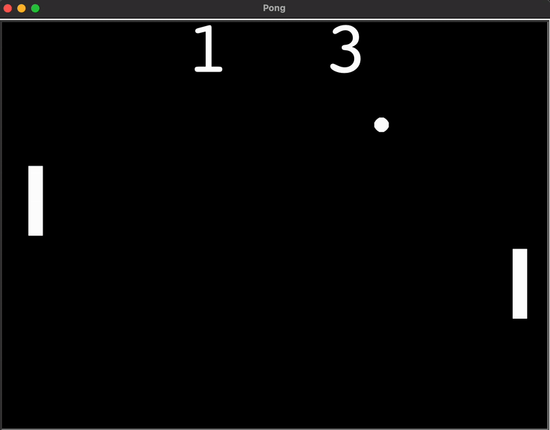

# 🏓 Classic Pong Game
A simple Python implementation of the **classic Pong game** using the `turtle` graphics module. Challenge a friend in this two-player arcade game where you control paddles, bounce the ball, and score points! 🎮

## ✨ Features
🕹️ Two-player controls (`W/S` for left paddle, `↑/↓` for right paddle).  
⚡ Smooth ball movement with increasing speed.  
📊 Real-time scoreboard.  
🎯 Collision detection with walls and paddles.  
🔄 Ball reset when a player misses.  

## 🖥️ How to Play
1. Clone this repo:  
   ```
   git clone https://github.com/dharsan19/classic-pong-game.git  
   ```

2. Navigate into the project folder: 
   ``` 
   cd classic-pong-game
   ```

3. Run the game:
   ```
   python main.py
   ```

🎮 **Controls:**  
- Left Paddle → `W` (up), `S` (down)  
- Right Paddle → `Up Arrow` (up), `Down Arrow` (down)  

## 📸 Demo

<p align="center">
  
</p>

⚡ Enjoy the retro arcade vibes and have fun playing Pong!